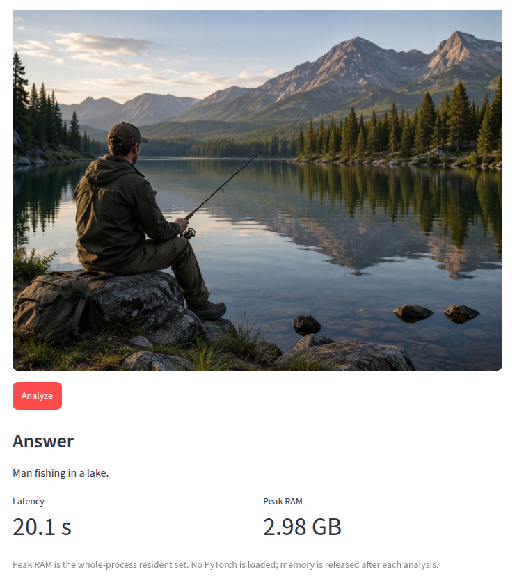

# vlmbench

[](https://doi.org/10.5281/zenodo.21781551)
[](LICENSE)

A CPU-only efficiency and quantization benchmark framework for small vision language models (VLMs). This tool enables benchmarking of small VLMs on CPU-only environments, measuring performance and resource utilization across different quantization methods and optimization techniques.

## Interactive demo

A lean, torch-free Streamlit demo runs **SmolVLM-256M in INT8 ONNX on CPU** —
upload an image, ask a question, and see the answer with its latency and peak
RAM. It fits modest hardware (Raspberry Pi 8 GB, a free ARM cloud VM, or
locally). See [`demo/README.md`](demo/README.md).



## Installation

Install the package in development mode with dev dependencies:

```bash
uv pip install -e '.[dev]'
```

To install with model support:

```bash
uv pip install -e '.[models]'
```

## Testing

Run the test suite:

```bash
.venv/bin/python -m pytest -v
```

Run only tests that don't require downloading models:

```bash
.venv/bin/python -m pytest -v -m 'not slow'
```

## Reproducing the paper

The measurement data behind every table and figure is versioned in this repo
(see [`DATA.md`](DATA.md) for the schema and the honest measurement caveats):
`results/`, `results_presence_coco/`, `results_presence_openvocab/`, and the
generated `paper_artifacts/`.

For an exact environment, install the pinned stack (Python 3.12):

```bash
pip install -r requirements-lock.txt
```

The paper's numbers come from these configs:

| Paper result | Config |
|---|---|
| DocVQA + OCRBench (Tables I–II) | `configs/large_eval.yaml` → `results/` |
| Presence, closed-vocab COCO (Table III) | `configs/presence_coco.yaml` → `results_presence_coco/` |
| Presence, open-vocab Fashionpedia (Table IV) | `configs/presence_openvocab.yaml` → `results_presence_openvocab/` |

Run a benchmark and (re)generate the tables/figures:

```bash
.venv/bin/python scripts/run_benchmark.py --config configs/large_eval.yaml --out results
.venv/bin/python scripts/measure_energy.py --config configs/large_eval.yaml --results results/results.jsonl
.venv/bin/python scripts/make_figures.py --results results/results.jsonl --out-dir paper_artifacts
# presence tables/figure (Florence-2 excluded: its <OCR> adapter emits no yes/no)
.venv/bin/python scripts/make_figures.py \
  --results results_presence_coco/results.jsonl results_presence_openvocab/results.jsonl \
  --out-dir paper_artifacts --figure tradeoff_presence.png --exclude florence2-base
```

The companion paper repo picks these up with `make sync`. See
[`docs/known-issues.md`](docs/known-issues.md) for the dated reproducibility log.
